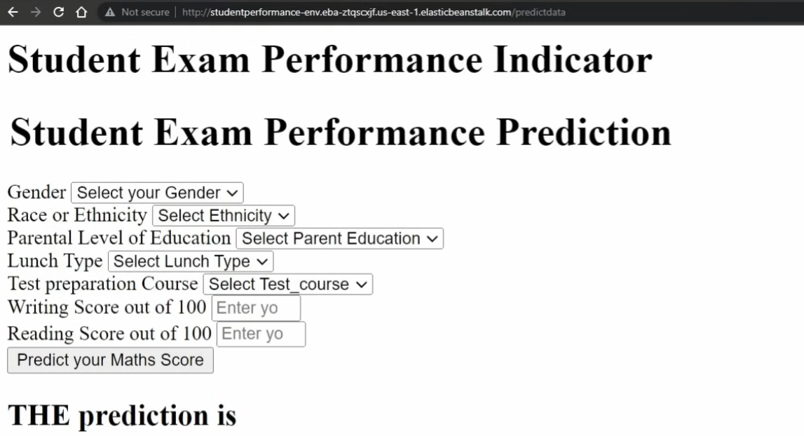

# 🎓 Student Exam Performance Prediction

Welcome to the **Student Exam Performance Prediction** project! This repository contains a complete end-to-end machine learning pipeline to predict students' math scores based on various socio-economic factors. Deployed on AWS Elastic Beanstalk, this project demonstrates a comprehensive workflow from data preprocessing to model deployment.



---

## 📋 Table of Contents

- [Project Overview](#project-overview)
- [Dataset](#dataset)
- [Project Structure](#project-structure)
- [Setup and Installation](#setup-and-installation)
- [Exploratory Data Analysis](#exploratory-data-analysis)
- [Data Transformation](#data-transformation)
- [Model Training and Evaluation](#model-training-and-evaluation)
- [Deployment](#deployment)
- [Results](#results)
- [Acknowledgments](#acknowledgments)

---

## 📖 Project Overview

This project utilizes machine learning to predict students' math scores based on input features such as gender, parental education level, lunch type, and test preparation courses. The application provides an intuitive interface for users to input these factors and receive predictions on the expected math score.

## 📊 Dataset

The dataset contains information on students' scores in math, reading, and writing. Key features include:
- **Gender**
- **Race/Ethnicity**
- **Parental Level of Education**
- **Lunch Type**
- **Test Preparation Course Completion**
- **Scores** in Writing, Reading, and Math

---

## 📁 Project Structure


---

## 🛠️ Setup and Installation

1. **Clone the repository**:
   ```bash
   git clone https://github.com/daata-digger/ML-Project
   cd StudentPerformancePrediction
2. **Create a virtual environment**:
    ```bash
    python -m venv env
    source env/bin/activate  # On Windows use `env\Scripts\activate`
3. **Install the dependencies**:
    ```bash
    pip install -r requirements.txt
4. **Run the application locally**:
    ```bash
    python application.py
Navigate to http://127.0.0.1:5000 in your browser to access the application.

# 🔍 Exploratory Data Analysis
In the [EDA notebook](notebook/1. EDA STUDENT PERFORMANCE.ipynb), we analyze the dataset to understand the distributions, relationships, and possible outliers among the features. Key steps include:

Visualizing distributions of scores across different demographic groups.
Investigating correlations between features and target variable.
Identifying missing values and planning for data preprocessing.

# 🔄 Data Transformation
The data transformation pipeline (implemented in src/components/data_transformation.py) includes:

Numerical Processing: Imputing missing values and scaling.
Categorical Processing: Imputing missing values, one-hot encoding, and scaling.
Pipeline Integration: Combining both categorical and numerical transformations into a single pipeline using ColumnTransformer.

# 🤖 Model Training and Evaluation
In the [Model Training notebook](notebook/2. MODEL TRAINING.ipynb), various models were tested, and the best-performing model was selected based on evaluation metrics. The steps include:

Splitting data into training and test sets.
Training and tuning the model using Grid Search for optimal parameters.
Evaluating model performance using metrics such as Mean Absolute Error (MAE) and Root Mean Square Error (RMSE).

## 🚀 Deployment

> **Note**: The deployment on AWS Elastic Beanstalk has been revoked. However, you can re-deploy the application by following the steps outlined below.

### Steps to Deploy on AWS Elastic Beanstalk

1. **Initialize Elastic Beanstalk**: Ensure you have the AWS CLI and Elastic Beanstalk CLI installed and configured.
   ```bash
   eb init -p python-3.12 StudentPerformancePrediction --region us-east-1
Happy Coding...